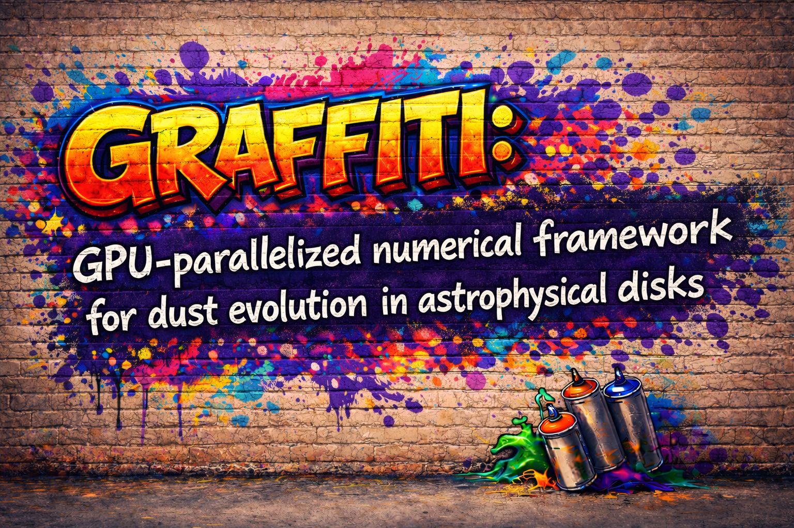

# GRAFFITI



**GRAFFITI: <u>G</u>PU-pa<u>r</u>allelized numeric<u>a</u>l <u>f</u>ramework <u>f</u>or dust evolution <u>i</u>n as<u>t</u>rophysical d<u>i</u>sks**

GRAFFITI is a high-performance CUDA-based simulation framework for modeling dust evolution in astrophysical disks. It leverages GPU parallelization to simulate millions of dust particles using the Lagrangian super-particle approach, including dynamics, collisions, diffusion, and radiative processes.

## Features

- **Particle-Based Simulation**: Tracks more than 10⁷ super-particles representing dust evolution
- **KD-Tree Neighbor Search**: Efficient collision detection using header-only [`cukd` library](https://github.com/ingowald/cudaKDTree) (open-sourced by Ingo Wald)
- **Modular Physics**:
  - Aerodynamic drift under gas drag
  - Radiation pressure
  - Turbulent diffusion
  - Collision and coagulation/fragmentation
- **Flexible Configuration**: Compilation flags for enabling/disabling physics modules
- **Model-Based Override System**: Selectively override default implementations by placing custom files in model directories
- **Resume Capability**: Save and resume simulations from checkpoints

## Requirements

- **NVIDIA CUDA Toolkit** (tested with CUDA 11+)
- **NVIDIA GPU** with CUDA compute capability (e.g., sm_70, sm_80, sm_86)
  - Change target GPU architecture in `Makefile`: `NVCC += -arch=sm_80`
- **Standard C++ compiler** with C++17 support

## Quick Start

### Build

GRAFFITI uses a model-based build system. You must specify a `MODEL` when building:

```bash
# Example: Build the linear_kernel_test model
make MODEL=linear_kernel_test
```

The model directory (`mod/<MODEL>/`) should contain:
- **(required)** `flags.mk`: Compilation flags for physics modules
- **(optional)** `*.cuh`: Model-specific header files that override defaults from `inc/`
- **(optional)** `*.cu` files: Model-specific source files that override defaults from `src/`

To add entirely new model-specific files (not just overrides), append their names to `_INC_MOD` or `_OBJ_MOD` in your `flags.mk`:
```makefile
_INC_MOD = custom_header.cuh
_OBJ_MOD = custom_kernel.o
```

**Model-Specific File Overriding:**

GRAFFITI's build system allows models to selectively override default implementations:
- If a `.cu` file exists in `mod/<MODEL>/`, it will be compiled instead of the corresponding file in `src/`
- This enables testing different implementations without modifying the core codebase
- For example, placing `col_rate_calc.cu` in `mod/linear_kernel_test/` will use that custom collision kernel instead of `src/col_rate_calc.cu`
- Similarly, placing `const.cuh` in the model directory overrides `inc/const.cuh` for that model only
- All non-overridden files automatically use the default implementations from `src/` and `inc/`

### Run

```bash
# Fresh start
./mod/<MODEL>/graffiti

# Resume from saved frame
./mod/<MODEL>/graffiti <frame-number>
```

Output files are written to `out/<MODEL>/`.

**Resuming Simulations:**

GRAFFITI supports resuming simulations from saved checkpoints, allowing you to continue interrupted runs or extend completed simulations:

1. **Finding Available Frames**: Saved particle data files in `out/<MODEL>/` are named with frame numbers (e.g., `particles_00000.bin`, `particles_00001.bin`). Use these numbers to resume.

2. **Resume Command**: To resume from a specific frame, provide the frame number as a command-line argument:
   ```bash
   ./mod/<MODEL>/graffiti 42  # Resume from frame 42
   ```

3. **What Happens on Resume**:
   - The code reads particle data (positions, velocities, sizes, masses) from the specified frame file
   - Simulation time is reconstructed from the frame number and output interval
   - The evolution continues from that point forward with the same physics settings
   - New output files continue the numbering sequence (frame 43, 44, ...)

4. **Important Notes**:
   - The model configuration (`flags.mk`, `const.cuh`) must match the original run's settings
   - Grid-based fields (optical depth, dust density) are recomputed from the loaded particle data
   - RNG states are reinitialized, so the exact sequence won't match a continuous run
   - Resume is particularly useful for extending simulations to longer times or recovering from system failures

### Clean

```bash
# Clean specific model
make clean MODEL=linear_kernel_test

# Clean all models
make clean
```

## Configuration

### Physics Modules

Control simulation features via compilation flags in `mod/<MODEL>/flags.mk`:

| Flag | Description |
|------|-------------|
| **Physics Modules** | |
| `-DTRANSPORT` | Enable aerodynamic drift (required for RADIATION and DIFFUSION) |
| `-DRADIATION` | Enable radiation pressure (requires TRANSPORT) |
| `-DDIFFUSION` | Enable turbulent diffusion (requires TRANSPORT) |
| `-DCOLLISION` | Enable particle collisions (independent of TRANSPORT) |
| **Extra Constraints** | |
| `-DCONST_NU` | Use constant kinematic viscosity instead of α-parameter |
| `-DCONST_ST` | Use constant Stokes number instead of constant physical size |
| **File Output Features** | |
| `-DSAVE_DENS` | Save dust density field to output files |
| `-DLOGTIMING` | Use dynamic, logarithmic time stepping for simulation evolution |
| `-DLOGOUTPUT` | Use logarithmic output intervals with fixed timesteps |
| **Numerical Features** | |
| `-DCODE_UNIT` | Use code units instead of CGS units |
| `-DIMPORTGAS` | Import gas disk parameters from external file instead of analytical profiles |

**Important**: When `TRANSPORT` is OFF, both `RADIATION` and `DIFFUSION` are inactive regardless of their settings. `COLLISION` is independent and can be enabled even when `TRANSPORT` is OFF.

### Importing Gas Disk Data

When `-DIMPORTGAS` is enabled, GRAFFITI reads gas disk parameters from external binary files instead of using analytical profiles:

**Required Gas Files:**

When `-DIMPORTGAS` is enabled, the following binary files must be present in `PATH_OUT` (output directory):
- `gasdens_XXXXX.dat`: Gas density on the grid (N_G values)
- `gasvelx_XXXXX.dat`: Gas velocity in X direction (azimuthal, N_G values)
- `gasvely_XXXXX.dat`: Gas velocity in Y direction (radial, N_G values)
- `gasvelz_XXXXX.dat`: Gas velocity in Z direction (colatitudinal, N_G values)
- `epsilon_XXXXX.dat`: Dust-to-gas ratio on the grid (N_G values, used for initialization only)

Where `XXXXX` is the 5-digit frame number (e.g., `00000` for initial conditions, `00042` for frame 42).

**Important**: The gas velocities (`gasvelx/y/z`) are actual velocities in spherical coordinates (azimuthal, radial, colatitudinal). This is different from the particle representation where `particle.velocity.x` and `particle.velocity.z` store specific angular momenta rather than velocities.

**When Gas Files Are Read:**

1. **Initialization**: At program start (or resume), gas data is loaded from frame 0 (or the specified resume frame)
2. **During Evolution**: Gas data is reloaded at each output frame to update the disk structure
3. **Kernels**: The gas data is passed to device kernels that need it (collision, diffusion, transport)

**What Changes with Imported Gas:**

With `-DIMPORTGAS`, the following calculations use imported data instead of analytical formulas:

- **Gas Density**: Uses `gasdens` array instead of power-law profile from `SIGMA_0` and `IDX_P`
- **Gas Velocities**: Uses `gasvelx/y/z` arrays instead of Keplerian velocity calculations
- **Particle Initialization**: Uses `epsilon` (dust-to-gas ratio) to determine initial particle distribution instead of uniform sampling
- **Collision Kernels**: Gas properties affect collision rates and outcomes
- **Diffusion Kernels**: Turbulent diffusion uses local gas density and scale height from imported data
- **Transport Kernels**: Drag force calculations use imported gas velocities

**Important Notes:**
- **Grid resolution matching**: Gas files must match the grid resolution (`N_X`, `N_Y`, `N_Z`)
- **File completeness**: All gas files must be present for each frame; missing files will cause the simulation to abort
- **Gas density validation**: The imported gas density field must not contain non-positive values; the simulation will fail if zeros or negative densities are present
- **SIGMA_0 normalization**: Although most analytical parameters are ignored with `-DIMPORTGAS`, **`SIGMA_0` must be manually set** to normalize the external gas density field. Stokes numbers are calculated based on the imported density profile normalized by `SIGMA_0`, making this parameter critical for correct dynamics
- **Gas density gradients**: Diffusion kernels calculate gas density gradients directly from the imported files, not from analytical formulas
- **Epsilon file for initialization**: The `epsilon_00000.dat` file is **required** if you want to initialize dust particle positions following the provided gas density profile. Without this file, initialization will fail when using `-DIMPORTGAS`
- **Use case**: Use `-DIMPORTGAS` when coupling with hydrodynamic simulations or non-standard disk structures

## Project Structure

```
graffiti/
├── inc/                      # Header files
│   ├── const.cuh            # Default simulation constants
│   ├── graffiti_host.cuh    # Host function declarations
│   ├── graffiti_kern.cuh    # Kernel declarations
│   ├── helpers_*.cuh        # Device helper functions
│   └── cukd/                # KD-tree library (header-only)
├── src/                      # Default source implementations
│   ├── graffiti_main.cu     # Main program & evolution loop
│   ├── collision.cu         # Collision kernels
│   ├── diffusion_*.cu       # Diffusion kernels
│   ├── particle_init.cu     # Initialization
│   └── ...
├── mod/                      # Model configurations
│   └── <MODEL>/             # Specific model setup
│       ├── flags.mk         # Compilation flags
│       ├── const.cuh        # Model constants (optional)
│       └── *.cu             # Model-specific overrides (optional)
├── obj/<MODEL>/             # Build artifacts (ignored)
├── out/<MODEL>/             # Simulation output (ignored)
├── doc/                     # Documentation & images
└── Makefile                 # Build system
```

## Code Organization

### Key Files

- **`src/graffiti_main.cu`**: Program entry point, main evolution loop, tree building, and I/O orchestration
- **`inc/const.cuh`**: Single source for simulation constants and structures (e.g., `struct swarm`)
- **`src/col_*.cu`**: Collision-related kernels including rate calculation and handling (`col_rate_calc`, `col_proc_exec`)
- **`src/*_init.cu`**: Initialization routines for particles, grids, and RNG states

### Particle Data Structure

The `struct swarm` (defined in `inc/const.cuh`) represents individual dust particles with the following important convention:

- **`position.x/y/z`**: Particle positions in spherical coordinates (azimuthal angle, radius, colatitude)
- **`velocity.x`**: Specific azimuthal angular momentum (NOT azimuthal velocity)
- **`velocity.y`**: Radial velocity
- **`velocity.z`**: Specific polar angular momentum (NOT colatitudinal velocity)
- **`size`**: Reference size of individual dust grains in units of `S_0` (reference grain size defined in `const.cuh`)
- **`numr`**: Number of individual dust grains represented by this super-particle

This representation differs from imported gas data (`gasvelx/y/z`), which stores actual velocities in all three directions.

### Coding Conventions

- **Declarations**: Kernels in `inc/graffiti_kern.cuh`, host helpers in `inc/graffiti_host.cuh`, device helpers in `inc/helpers_*.cuh`
- **Implementations**: In corresponding `src/*.cu` files
- **Memory**: Host uses `cudaMallocHost` (pinned), device uses `cudaMalloc`
- **Grid Indexing**: Cells computed from positions; respect `N_X/N_Y/N_Z` constants
- **RNG**: Host uses `std::mt19937`, device uses `curandState` per-thread

## Output Files

Binary output files saved to `out/<MODEL>/`:
- Particle data: positions, velocities (and specific angular momenta), sizes, masses
- Grid fields: optical depth, dust density
- Frame naming controlled by `open_bin_file()` and `save_bin_file()` in `inc/graffiti_host.cuh`

## License

[License information to be added]

## Contact

For questions, issues, or contributions, please contact bi@mpia.de or open an issue on the repository.

---

**Note**: This is a research code under active development. Performance characteristics and API may change between versions.
